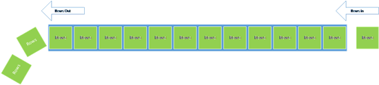

# Automatische Beibehaltungsrichtlinie f&#252;r Echtzeitdaten
---

Die automatische Beibehaltungsrichtlinie im Power BI-Dienst ist eine Abfragezeichenfolge, die eine standardmäßige Beibehaltungsrichtlinie zum automatischen Bereinigen veralteter Daten aktiviert, während ein konstanter Fluss neuer Daten in das Dashboard gewahrt bleibt.
Die erste Beibehaltungsrichtlinie wird auf Basis von First In First Out (FIFO) aufgerufen.
Wenn diese Richtlinie aktiviert ist, werden Daten in einer Tabelle gesammelt, bis max. 200.000 Zeilen erreicht sind.
Sobald die Daten über 200.000 Zeilen hinausgehen, werden die ältesten Zeilen aus dem Dataset gelöscht.
Dadurch werden zwischen 200.000 und 210.000 Zeilen mit ausschließlich den neuesten Daten beibehalten.

Die Beibehaltungsrichtlinien werden beim ersten Erstellen Ihrer Datasets aktiviert.
Dazu müssen Sie lediglich den Abfrageparameter "defaultRetentionPolicy" zu Ihrem POST-Aufruf für Datasets hinzufügen und ihn auf "basicFIFO" festlegen.

    POST https://api.powerbi.com/v1.0/myorg/datasets?defaultRetentionPolicy={None | basicFIFO}

##Weitere Informationen zum Aktivieren einer standardmäßigen Beibehaltungsrichtlinie

-   [Dataset erstellen](Create-Dataset.md)
-   [Testen Sie den Aufruf jetzt mit unserer interaktiven API-Konsole](http://docs.powerbi.apiary.io/#reference/datasets/datasets-collection/create-a-dataset)

