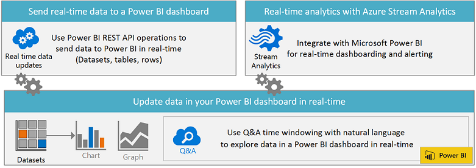

# Erstellen eines Power&#160;BI-Dashboards in Echtzeit
---

Sie können ein Power BI-Dashboard mit der Microsoft Power BI-REST-API oder Microsoft Stream Analytics in Echtzeit erstellen.
Fügen Sie vorhandenen Lösungen schnell Analysen hinzufügen, um Daten in Echtzeit zu überwachen.

###Verwenden der Power BI-REST-API zum Senden von Daten an ein Power BI-Dashboard in Echtzeit

Mit der Power BI-REST-API können Sie Ihre eigene Unternehmenslösung erstellen, um Daten eines beliebigen Typs in Echtzeit in ein Power BI-Dashboard zu übertragen.
Ihre Dashboards werden bei Änderungen der Daten in Echtzeit aktualisiert.
Sie können zum Schreiben der App eine beliebige Technologie wie etwa .NET, JQuery oder Ruby verwenden.
Die Power BI-REST-API verwendet Industriestandards wie das OAuth2-Protokoll. Zudem beinhaltet sie REST-Vorgänge für die Echtzeitübertragung von Daten in ein Power BI-Dashboard.

[Erste Schritte beim Erstellen einer Power BI-App](Get-started-creating-a-Power-BI-app.md)

-   Erstellen von Datasets und Hinzufügen und Löschen von Zeilen
-   Echtzeitübertragung von Daten aus beliebigen Apps in Power BI
-   Festlegen einer Beibehaltungsrichtlinie zum automatischen Bereinigen veralteter Daten
-   Ermitteln von Metadaten in vorhandenen Datasets

###Verwenden von Azure Stream Analytics für Echtzeit-Dashboarding und -warnungen in Power BI

Microsoft Azure Stream Analytics ist ein vollständig verwalteter Echtzeitdienst für die Stream-Berechnung. Er zeichnet sich durch die skalierbare Verarbeitung von Streaming-Daten in der Cloud mit einem Unternehmens-SLA und kurzen Wartezeiten aus.
Durch die Integration in Microsoft Azure Event Hubs und Microsoft Power BI sind das Echtzeit-Dashboarding und -warnungen zusammen mit effektiven Visualisierungen über Datenpipelines möglich.

Erfahren Sie mehr über [Azure Stream Analytics](http://azure.microsoft.com/services/stream-analytics).

-   Erfassung von Millionen Ereignisse pro Sekunde (maximal 1 GB/s)
-   Kurze Wartezeit bei der Verarbeitung, automatisch adaptiv (unter einer Sekunde)
-   Korrelation zwischen unterschiedlichen Streams oder mit Verweisdaten
-   Ermitteln von Datenmustern oder fehlenden Datenmustern in Echtzeit

###Verwenden Sie Abfragen in natürlicher Sprache (Q&A), um in Ihren Daten nach Antworten zu suchen.

Mit Q&A können Sie mithilfe der Zeitfenstererstellung mit natürlicher Sprache Daten in Power BI in Echtzeit erkunden. Zeigen Sie dynamische Zeiträume mit einer Spalte für die UTC-Zeit mithilfe von Fragen und Antworten wie folgt an:
-   Herzfrequenz von Josh in den vergangenen 10 Minuten
-   Gesamtanzahl der Besuche in den vergangenen 90 Minuten nach Zeit
-   Gesamtanzahl der Besuche in den vergangenen 90 Minuten nach Ortszeit, wenn UTC-Zeit

Erfahren Sie mehr über [Fragen und Antworten in Power BI](https://support.powerbi.com/knowledgebase/articles/474690).

