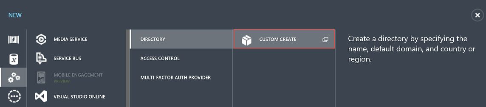
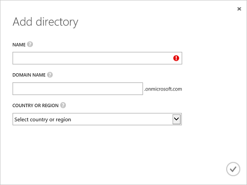
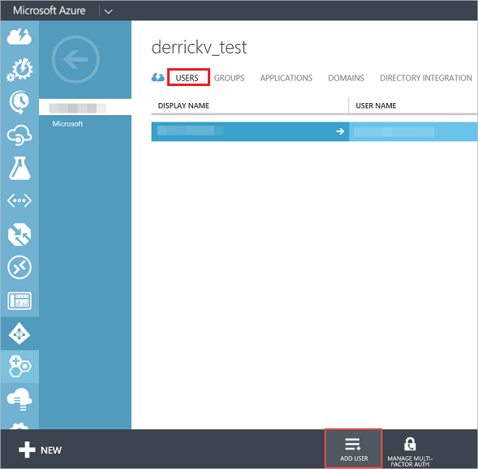
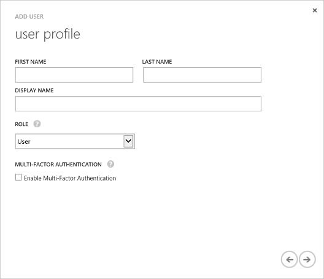

# Erstellen eines Azure Active Directory-Mandanten
---

Die Power BI-REST-API ermöglicht es Ihnen, Power BI-Apps auf allen Plattformen zu erstellen, die das Aufrufen von REST-Vorgängen unterstützen.
Bevor Sie jedoch eine Power BI-App erstellen, brauchen Sie ein **Azure Active Directory** und einen Organisationsbenutzer sowie ein [Power BI-Dienstkonto](Sign-up-for-Power-BI-service.md).

###Inhalt dieses Artikels

- [Erstellen eines Azure Active Directory-Mandanten](#setup)
- [Hinzufügen eines Benutzers zum Azure Active Directory-Mandanten](#newuser)

##Erstellen eines Azure Active Directory-Mandanten für eine Power BI-App

Power BI-Apps sind in **Azure Active Directory** (Azure AD) integriert, um eine sichere Anmeldung und Autorisierung Ihrer App zu ermöglichen.
Zum Integrieren einer Power BI-App in Azure AD registrieren Sie Ihre Anwendung über das Azure-Verwaltungsportal in Azure AD.

**Wichtig** Zum Registrieren beim **Power BI-Dienst** muss Ihr **Azure Active Directory** mindestens einen Organisationsbenutzer aufweisen.
Verwenden Sie Ihren Organisationsbenutzer zum [Registrieren beim Power BI-Dienst](Sign-up-for-Power-BI-service.md).

###Erstellen eines Azure Active Directory-Mandanten

Bevor Sie eine Power BI-App erstellen können, benötigen Sie **Azure Active Directory** und einen Organisationsbenutzer.
So richten Sie **Azure Active Directory** ein:

1. Navigieren Sie zu https://manage.windowsazure.com und melden Sie sich mit dem Konto an, das über ein Azure-Abonnement verfügt.
2. Klicken Sie im linken Bereich auf das Verwaltungssymbol für **ACTIVE DIRECTORY**.

    

3. Klicken Sie am unteren Rand der Seite auf **NEU**.
4. Wählen Sie **APP-DIENSTE** > **ACTIVE DIRECTORY** > **VERZEICHNIS** > **BENUTZERDEFINIERT ERSTELLEN** aus.

    

5. Geben Sie auf der Seite **Verzeichnis hinzufügen** einen Namen und einen Domänennamen ein.
    Wählen Sie für das Land bzw. die Region die Vereinigten Staaten oder das Land, in dem Power BI verfügbar ist.
    
    

6. Klicken Sie auf das Symbol "OK".
    Ein Azure Active Directory-Verzeichnis wird erstellt.

###Hinzufügen eines Benutzers zum Azure Active Directory-Mandanten

Sie verwenden den Benutzer in Ihrem Azure AD zum Registrieren beim **Power BI-Dienst**.
Nachdem Sie sich zum ersten Mal beim **Power BI-Dienst** angemeldet haben, wird der zu Ihrem Azure AD hinzugefügte **Power BI-Dienst** angezeigt, der Ihnen das Erstellen von Power BI-Apps mit den richtigen Berechtigungen ermöglicht.
So fügen Sie einen Benutzer zu Azure Active Directory hinzu:

1. Navigieren Sie zu https://manage.windowsazure.com und melden Sie sich mit dem Konto an, das über ein Azure-Abonnement verfügt.
2. Klicken Sie im linken Bereich auf das Verwaltungssymbol für **ACTIVE DIRECTORY**.
3. Klicken Sie am unteren Rand der Seite auf **NEU**.
4. Wählen Sie **APP-DIENSTE** > **ACTIVE DIRECTORY** > **VERZEICHNIS** > **BENUTZERDEFINIERT ERSTELLEN** aus.

    

5. Geben Sie auf der Seite **Verzeichnis hinzufügen** einen Namen und einen Domänennamen ein.
    Wählen Sie für das Land bzw. die Region die Vereinigten Staaten oder das Land aus, in dem Data Catalog verfügbar ist.
    
    

6. Klicken Sie auf das Symbol "OK".
    Ein Azure Active Directory-Verzeichnis wird erstellt.

###Hinzufügen eines Benutzers zum Azure Active Directory-Mandanten

Sie benötigen einen Benutzer aus Ihrem Azure AD, um eine Azure AD-App zu registrieren.
So fügen Sie einen Benutzer zu Ihrem **Azure Active Directory**-Mandanten hinzu:

1. Klicken Sie in Ihrem **Azure Active Directory** auf **BENUTZER**.

    

2. Klicken Sie unten auf der Seite auf **BENUTZER HINZUFÜGEN**.
    Zum Registrieren einer Power BI-App wird ein Benutzerkonto verwendet.
    
3. Auf der Seite **Erzählen Sie uns von diesem Benutzer**:

    1. Wählen Sie für **ART DES BENUTZERS** die Option **Neuer Benutzer in Ihrem Unternehmen** aus.
    2. Geben Sie Ihren **BENUTZERNAMEN** ein.
    3. Klicken Sie auf **Weiter**.

        

4. Geben Sie auf der Seite **Benutzerprofil** Ihren **ANZEIGENAMEN** ein.
    Der Anzeigename ist ein Pflichtfeld.

    

5. Klicken Sie auf **Weiter**.
    Als **ROLLE** können Sie **Benutzer** verwenden.

6. Klicken Sie auf **Erstellen**, um ein temporäres Kennwort zu erstellen.
    Dem neuen Benutzer wird ein temporäres Kennwort zugewiesen, das bei der ersten Anmeldung geändert werden muss.
7. Kopieren Sie auf der Seite **Vorübergehendes Kennwort abrufen** das temporäre Kennwort, und klicken Sie dann auf das Symbol **Fertig stellen**.
    Sie verwenden das temporäre Kennwort bei der ersten Anmeldung bei AAD.
8. Nachdem Sie auf das Symbol **Fertig stellen** geklickt haben, wird ein neuer Azure AD-Benutzer erstellt.

Nachdem Sie einen **Azure Active Directory**-Mandanten und einen Organisationsbenutzer erstellt haben, registrieren Sie sich bei Power BI.

##Nächster Schritt zum Erstellen einer Power BI-App: Registrierten bei Power BI

- [Registrieren bei Power BI](Sign-up-for-Power-BI-service.md)

**Hinweis** Verwenden Sie zum Registrieren beim Power BI-Dienst Ihren Organisationsbenutzer.
Nachdem Sie sich zum ersten Mal beim **Power BI-Dienst** angemeldet haben, wird der zu Ihrem Azure AD hinzugefügte **Power BI-Dienst** angezeigt.

##Siehe auch

- [Was ist ein Azure AD-Verzeichnis?](https://msdn.microsoft.com/en-us/library/azure/jj573650.aspx)
- [Abrufen eines Azure Active Directory-Mandanten](https://azure.microsoft.com/en-us/documentation/articles/active-directory-howto-tenant/)

