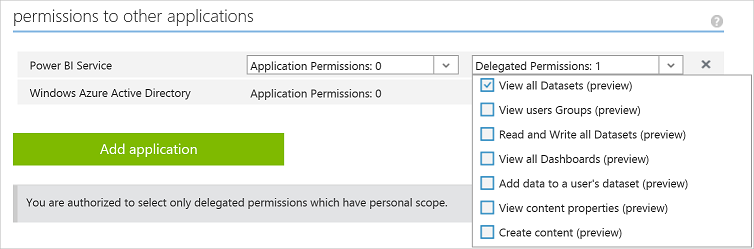

# Registrieren einer Client-App
---

In diesem Artikel erfahren Sie, wie Sie eine Power BI-Client-App in **Azure Active Directory (Azure AD)** registrieren. Sie registrieren Ihre Client-App bei Azure AD, um Ihrer Anwendung den Zugriff auf die Power BI-REST-API zu ermöglichen. Auf diese Weise können Sie eine Identität für Ihre Anwendung erstellen und Berechtigungen für Power BI-REST-Ressourcen angeben. Eine Liste mit Power BI-Berechtigungen finden Sie unter [Power BI-Berechtigungen](Power-BI-Permissions.md).

**Wichtig** Bevor Sie eine Power BI-App registrieren, brauchen Sie einen [Azure Active Directory-Mandanten und einen Organisationsbenutzer](Create-an-Azure-Active-Directory-tenant.md) sowie ein [Power BI-Dienstkonto](Sign-up-for-Power-BI-service.md).
Es gibt zwei Methoden zum Registrieren Ihrer Client-App: mit dem Power BI-App-Registrierungstool oder mit dem Azure-Verwaltungsportal. Das Power BI-App-Registrierungstool ist die einfachste Option, da nur wenige Felder ausgefüllt werden müssen. Mit diesem Tool müssen Sie jedoch das Azure-Verwaltungsportal verwenden, um Ihre App-Einstellungen zu verwalten.
###Inhalt dieses Artikels

- [Registrieren einer Client-App beim Azure-Verwaltungsportal](#client)
- [Abrufen einer Client-ID im Azure-Verwaltungsportal](#clientID)

##Registrieren einer Client-App beim Azure-Verwaltungsportal

Sie müssen Ihre Client-App in **Azure Active Directory** registrieren, um eine Identität für Ihre Anwendung zu erstellen und Berechtigungen für Power BI-REST-Ressourcen festzulegen. Wenn Sie eine Client-App registrieren (z. B. eine Konsolenanwendung), erhalten Sie eine **Client-ID**. Die Anwendung identifiziert sich mithilfe der **Client-ID** bei den Benutzern, von denen sie Berechtigungen anfordert.

Informationen zum Authentifizieren einer Client-App mit einer Azure AD-**Client-ID** finden Sie unter [Authentifizieren einer Client-App](Authenticate-a-client-app.md).

###Registrieren einer Client-App

So registrieren Sie eine Client-App:
1. Akzeptieren Sie die [Nutzungsbedingungen für die Microsoft Power BI-API](https://powerbi.microsoft.com/en-us/api-terms).
2. Melden Sie sich bei Ihrem Microsoft Azure-Abonnement unter https://manage.windowsazure.com an.
3. Wählen Sie im linken Dienstbereich **ACTIVE DIRECTORY** aus.
4. Klicken Sie auf das Active Directory, zu dem Sie gehören.

    

5. Klicken Sie auf **ANWENDUNGEN**.

    

6. Klicken Sie auf **HINZUFÜGEN**.

    

7. Geben Sie unter **Erzählen Sie uns von Ihrer Anwendung** im Feld **NAME** einen Namen ein. Wählen Sie als Typ **SYSTEMEIGENE CLIENTANWENDUNG**, und klicken Sie auf das Symbol für **Weiter**.

    

8. Geben Sie im Feld **Anwendungsinformationen** einen **UMLEITUNGS-URI** ein. In Bezug auf eine Client-App bietet ein Umleitungs-URI Azure AD ausführlichere Informationen über die zu authentifizierende Anwendung. Für eine Client-App können Sie den folgenden URI verwenden: https://login.live.com/oauth20_desktop.srf.

9.  Klicken Sie auf das Symbol für **Fertigstellen**.
10. Wählen Sie auf der Anwendungsseite **KONFIGURIEREN** aus. Ihre **CLIENT-ID** wird angezeigt.
11. Klicken Sie auf der Seite **KONFIGURATION** unter den Berechtigungen für andere Anwendungen auf **Anwendung hinzufügen**.

    

12. Wählen Sie unter **Berechtigungen für andere Anwendungen** die Option **Power BI-Dienst** aus.

    

    **Wichtig** Wenn **Power BI-Dienst** in der Liste **Berechtigungen für andere Anwendungen** nicht angezeigt wird, registrieren Sie sich beim [Power BI-Dienst](https://www.powerbi.com/). Zum Registrieren beim Power BI-Dienst benötigen Sie in Ihrem Azure Active Directory (AD)-Mandanten mindestens einen Organisationsbenutzer. Wenn Sie keinen Azure Active Directory (AD)-Mandanten haben, finden Sie unter [Einrichten von Azure Active Directory](Setup-Azure-Active-Directory.md) Informationen zum Erstellen eines Azure AD-Mandanten und eines damit verbundenen Organisationsbenutzers.

13. Klicken Sie auf das Symbol für **Fertigstellen**.
14. Wählen Sie in der Gruppe **Berechtigungen für andere Anwendungen** alle unter **Delegierte Berechtigungen** angezeigten Berechtigungen, und wählen Sie mindestens eine Berechtigung aus. Weitere Informationen zu Power BI-Berechtigungen finden Sie unter [Power BI-Berechtigungen](Power-BI-permissions.md).

    

15. Klicken Sie auf **Speichern**.

##Abrufen einer Client-App-ID

Wenn Sie eine Client-App registrieren (z. B. eine Konsolenanwendung), erhalten Sie eine **Client-ID**. Die Anwendung identifiziert sich mithilfe der **Client-ID** bei den Benutzern, von denen sie Berechtigungen anfordert.

So rufen Sie eine Client-ID ab:

1. Melden Sie sich bei Ihrem Microsoft Azure-Abonnement unter https://manage.windowsazure.com an.
2. Wählen Sie im linken Dienstbereich **ACTIVE DIRECTORY** aus.
3. Klicken Sie auf das Active Directory, zu dem Sie gehören.
4. Klicken Sie auf **ANWENDUNGEN**.
5. Wählen Sie eine Anwendung aus.
6. Wählen Sie auf der Anwendungsseite **KONFIGURIEREN** aus.
7. Kopieren Sie auf der Seite **KONFIGURIEREN** die **CLIENT-ID**.

    

##Nächste Schritte zum Erstellen einer Power BI-App

- [Erstellen Ihrer Power BI-App](Introduction-to-creating-a-Power-BI-app.md)
- [Informationen zum Authentifizieren in Azure AD](Authenticate-to-Power-BI-service.md)

